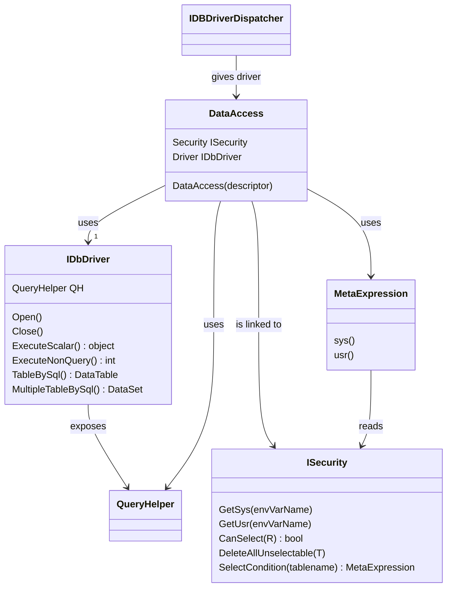

# DataAccess
DataAccess è la classe che si occupa di effettuare le operazioni elementari sul database, e fornisce vari metodi per leggere set di righe o anche singoli valori. Di solito **non è necessario** utilizzare questa classe quando si opera su interi DataSet, nel cui caso si usano  [GetData](GetData.md) e [PostData](PostData.md), che a loro volta usano la classe DataAccess.
Le operazioni sulle tabelle si avvalgono della conoscenza, da parte di MDL, della struttura del database, ai fini di migliorarne l'efficienza. 

Poiché vi possono essere più istanze di un DataAccess, tipicamente uno per ogni richiesta del client da sodisfare, l'informazione sulla struttura del database risiede in una classe diversa, [DbDescriptor](DbDescriptor.md) condivisa a livello di applicazione, per un uso ottimale della memoria.

Tramite DataAccess è possibile accedere, con un'interfaccia uniforme, a qualsiasi tipo di database, con interfacce asincrone per ogni operazione. 

## Modalità persistente e non persistente
E' possibile gestire la connessione in due modi principali, a seconda di cosa si ritenga più efficiente nel proprio caso d'uso:
- persistente (valore di default), in cui la connessione fisica al db è stabilita all'inizio della richiesta e rilasciata alla fine della richiesta. In questo caso ove ci sia una serie di accessi al db questi ne risultano notevolmente accelerati. In questa modalità è possibile iniziare e concludere una transazione senza preoccuparsi di dover aprire e chiudere la connessione.
- non persistente, in cui la connessione è aperta e chiusa (in automatico) per ogni operazione effettuata, tuttavia qualora si decida di creare una transazione manualmente la gestione dell'apertura (prima della chiamata a beginTransaction) e di chiusura (dopo la RollBack o la Commit) è a carico dello sviluppatore.

Nel caso si utilizzi una connessione persistente, all'inizio dell'elaborazione l'applicazione effettuerà una chiamata (asincrona) alla funzione Open(), assicurandosi che restituisca true, valore indicante il successo. Poi al termine sarà cura dell'applicazione richiamare il metodo asincrono Close(), più efficiente che aspettare che si chiuda da sola durante la garbage collection.
Nel caso si opti per una connessione non persistente è necessario impostare a false la proprietà Persisting del DataAccess; per la maggior parte dei comandi di alto livello non sarà necessario alcuna particolare operazione, ma i comandi di scrittura di basso livello, quali sono le insert/update/delete/BeginTransaction/Commit/Rollback, per motivi di efficienza, è necessario che l'applicazione effettui l'apertura della connessione (e presumibilmente la BeginTransaction) e la chiusura della connessione (dopo la Rollback).

Se le richieste del client sono esaurite in poco tempo, o una richiesta comporta parecchi accessi al db, è certamente da preferirsi una connessione persistente. Sono rari i casi in cui potrebbe essere più efficiente una connessione non persistente.
Tuttavia, se nell'ambito di una connessione persistente si effettuano delle open/close annidate, la connessione rimane comunque aperta sin quando non è richiamato il metodo Destroy della classe, esplicitamente o nella G.C.

In ambo i casi, quindi, è possibile operare, nell'applicazione in modo identico, ossia come se si operasse in modo non persistente, poiché le open/close aggiuntive necessarie per la gestione non persistente (per gestire le transazioni) non avranno effetto sulle connessioni persistenti. Questo consentirà di stabilire se una connessione dovrà essere persistente o meno solo al momento in cui verrà creata, lasciando tutto il resto del programma invariato, accertandosi però di chiamare esplicitamente la Destroy della connessione al completamenteo della richiesta, per evitare che la sua invocazione sia demandata alla Garbage Collection.

# Principali funzioni

## Operazioni di query

	/// 

	/// Reads a DataTable from a db table. The table is created at run-time using  information
	///  stored in columntypes
	/// 

	/// <param name="tablename"></param>
	/// <param name="columnlist">list of field names separated by commas</param>
	/// <param name="order_by">list of field names separated by commas</param>
	/// <param name="filter">condition to apply, can be a string or a MetaExpression</param>
	/// <param name="TOP">how many rows to get at max</param>
	/// <param name="tableModel">when given, it is used as a model to create the table to read. It is not modified. </param>
	/// <returns>DataTable read</returns>
	Task<DataTable> Select(string tablename,
		object filter = null,
		string columnlist = "*",
		string order_by = null,
		string top = null,
		DataTable tableModel = null,
		int timeout = -1)

Select ottiene un DataTable ottenuto come una select da una tabella o vista con i parametri dati. Ha la stessa funzione di una SELECT sql, è portabile tra database diversi e asincrona. E' un comando semplice e potente.

	/// 

	/// Executes a List of Select, returning data in the tables specified by each select.  (ex MULTI_RUN_SELECT)
	/// 

	/// <param name="SelList"></param>
	Task MultipleSelect(List<SelectBuilder> SelList);

MultipleSelect esegue un batch di query con un unico roundtrip sul database, SelectBuilder è una classe per comporre delle select in modo molto semplice, ad esempio:

new SelectBuilder().IntoTable(Table).Where(filter).Top(100).OrderBy(sortColumns);

	/// 

	/// Executes a SELECT COUNT on a table.
	/// 

	/// <param name="tablename"></param>
	/// <param name="filter">string or MetaExpression</param>
	/// <returns></returns>
	Task<int> Count(string tablename, object filter=null);

Esegue una select count(*) filtrata su una tabella o vista

	/// 

	/// Reads a table without reading the schema. Result table has no primary key set.
	/// This is quicker than a normal select but slower than a RowObject_select
	/// 

	/// <param name="tablename"></param>
	/// <param name="columnlist"></param>
	/// <param name="filter">string or MetaExpression</param>
	/// <param name="orderBy"></param>
	/// <param name="TOP"></param>
	/// <returns></returns>
	Task<DataTable> ReadTableNoKey(string tablename, object filter=null, string columnlist="*", string orderBy = null, string TOP = null);

Questa funzione è simile a Select ma restituisce una tabella senza chiave, risultando così più veloce. In alcuni casi può essere conveniente da usare.

## Lettura dati in strutture dati esistenti
	
	Task ExecuteQueryIntoTable(DataTable table, string sql, int timeout = -1);	
	Task SqlIntoDataSet(DataSet d, string sql, int timeout);

	Task SelectIntoTable(DataTable T, object filter=null, string top=null, string orderBy=null, int timeout=-1);

Queste funzioni presuppongono che le tabelle esistenti abbiano tutte la primary key impostata.
Le prime due leggono dati in un dataset esistente, facendo un merge delle righe basandosi sulla chiave e sovrascrivendo le righe presenti ove abbiano la stessa chiave.
La terza invece legge i dati facendo il merge su un singolo DataTable esistente.
Queste funzioni sono utili se si intende leggere dati in più tranche usando la stessa struttura.

## Lettura dati in strutture diverse da DataTable

Queste funzioni fanno parte di un uso abbastanza avanzato del framework e non sono indispensabili.

Spesso capita di voler leggere dei dati senza avere l'intenzione di modificarli e scriverli di nuovo sul database. In questi casi non è necessario utilizzare un dataset o un datatable, ed è possibile leggere i dati in dictionary o oggetti dinamici. A tale scopo mdl utilizza o i dictionaries o la classe RowObject, che deriva da DynamicObject, al fine di poter accedere ai campi di un oggetto come se fossero campi di una normale classe.
Queste interrogazioni sono leggermente più veloci di quelle che leggono nei datatable e nei datasets.

	Task<Dictionary<string, object>[]> ReadDictionaries(string sql,  int timeout=-1);

Legge un set di risultati e lo pone in un array di dictionaries, in cui ogni elemento dell'array è un dictionary che rappresenta una riga del risultato, e ha come keys i nomi dei campi.

	Task<Dictionary<T, S>> ReadDictionary<T, S>(string tablename,            
				string keyField, string valueField,
				object filter=null
			)

Compone un dictionary a partire da una query su una tabella, in cui i valori delle chiavi e dei valori sono presi rispettivamente dai campi *keyfield* e *valueField*.

	Task<Dictionary<string, object>> ReadObject(string table, object filter=null, string expr="*")

Simile a ReadDictionaries con la differenza che legge una sola riga da una tabella, con uno specifico filtro, e restituisce un unico dictionary

	Task<Dictionary<T, RowObject>> SelectRowObjectDictionary<T>(string tablename,            
				string keyField, string fieldList,
				object filter=null
			)
Legge una tabella e compone un dizionario in cui le chiavi sono prese dal campo di nome	*keyField*	e come valori dei RowObject, ognuno dei quali rappresenta una riga del set di risultati, identificata da quel campo. Ovviamente presupposto è che *keyField* sia un identificatore univoco nel set di risultati.

	Task<List<RowObject>> SelectRowObjects(string tablename,
			string columnlist="*",
			object filter=null,
			string order_by = null,
			string TOP = null)

Restituisce una lista di RowObject, interrogando il contenuto di una tabella.

	Task<Dictionary<string, List<RowObject>>> RowObjectsBySql(string cmd, params string[] tables)

Questo comando è un'estensione rispetto al precedente.
Legge dei set di risultati dal database, accettando un comando sql per eseguire la query, e restituisce un dictionary in cui i valori della chiave sono i nomi delle tabelle indicati in *tables* mentre i valori sono liste di righe memorizzate in RowObject. Ogni lista di righe rappresenta un diverso set di righe restituito dal comando sql. In sostanza legge più tabelle.

## Invocazione di stored procedures

	Task<DataSet> CallSP(string sp_name, object[] parameters,  int timeout =-1);
	Task CallVoidSPParams(string sp_name, DbParameter[] parameters, int timeout=-1);
	Task<DataSet> CallSPParams(string sp_name, DbParameter[] parameters, int timeout=-1);

Questi metodi sono simili a quelli di ADO.NET ma gestiscono in automatico l'apertura della connessione, l'inserimento nella transazione ove presente, ed in più sono asincrone e portabili tra i diversi tipi di db. Attenzione però che non tutti i db supportano il passaggio dei parametri per nome, quindi ove possibile effettuare sempre la chiamata rispettando l'ordine dei parametri.
La prima ammette come parametri un elenco di oggetti, la seconda e la terza invece dei generici DbParameter, che quindi possono essere sia di input che di output, sia posizionali che nominativi. Infine la seconda non restituisce nulla, mentre la prima e la terza leggono una o più tabelle e le restituiscono in un DataSet.

## Operazioni "standard"

	/// 

	/// Async execute a sql statement amd returns the affected rows if any
	/// 

	/// <param name="commandString"></param>
	/// <param name="timeOut"></param>
	/// <returns>number of affected rows</returns>
	Task<int> ExecuteNonQuery(string sql, int timeOut = -1);

	/// 

	/// Returns a single value executing a SELECT expr FROM table WHERE condition. If no row is found, NULL is returned 
	/// 

	/// <param name="table"></param>
	/// <param name="filter">MetaExpression or string</param>
	/// <param name="expr"></param>
	/// <param name="orderBy"></param>
	/// <returns></returns>
	Task<object> ReadValue(string table, object filter=null, string expr="*", string orderBy = null);
          
	/// 

	/// Returns a value executing a generic sql command (ex DO_SYSCMD)
	/// 

	/// <param name="sql"></param>
	/// <param name="ErrMsg">eventual error message</param>
	/// <returns></returns>
	Task<object> ExecuteScalar(string sql, int timeout=-1);

	/// 

	/// Reads all values from a generic sql command and returns the last value read 
	/// 

	/// <param name="cmd"></param>
	/// <param name="ErrMsg"></param>
	/// <returns></returns>
	Task<object> ExecuteScalarLastResult(string sql,  int timeout=-1);

	/// 

	/// Async execute a sql statement to retrieve a table
	/// 

	/// <param name="sql"></param>
	/// <param name="timeout"></param>
	/// <returns></returns>
	Task<DataTable> ExecuteQuery(string sql, int timeout = -1);

	/// 

    /// Execute a sql cmd that returns a dataset (eventually with more than one table in it) 
    /// 

    /// <param name="sql">sql command to run</param>
    /// <param name="timeout">Timeout in seconds, 0 means no timeout, -1 means default timeout</param>
    /// <returns></returns>
    Task<DataSet>DataSetBySql(string sql, int timeout);

Questi metodi hanno scopi simili a quelli esposti dalla classe DbCommand di ADO.NET, con la differenza che si applicano uniformemente a tutti i database supportati, e automaticamente provvedono ad aprire la connessione ove la gestione sia di tipo non persistente. Inoltre se ci si trova in un ambito di una transazione e questa viene invalidata, viene scatenata un'eccezione, non prima di aver eseguito il rollback della transazione ed eventualmente  chiusa la connessione. ExecuteQuery è in qualche modo l'equivalente di DataAdapter.Fill, in quanto restituisce un DataTable.

ExecuteScalarLastResult legge una serie di valori con il comando passato e restituisce l'ultimo valore letto, a differenza di ExecuteScalar che restituisce il primo valore letto.

*Ognuno di questi comandi è inserito nella transazione corrente della connessione ove ve ne sia una.*

Una speciale nota merita ReadValue, poiché in esso troviamo il parametro filter, che è un object. I tipi ammessi sono [MetaExpression](MetaExpression.md) e string. MetaExpression è una classe dedicata alla composizione di filtri, ed è una particolarità probabilmente "unica" di MDL, e pertanto è spiegata nella [pagina dedicata](MetaExpression.md). Volendo invece usare come filtro una stringa, si perderà il vantaggio della portabilità su altri database e si dovrà farsi carico di tutte gli accorgimenti soliti, quale accertarsi di impedire le sql-injection etc. 
In tutte le funzioni che li ammettono come parametri, si dovrebbe cercare di usare una MetaExpression per i filtri ovunque sia possibile, o quanto meno, nel caso di filtri stringa, comporli con la classe [QueryHelper](QueryHelper.md) adatta al db che si sta usando. La classe QueryHelper "adatta" si può ottenere con il metodo *GetQueryHelper* del DataAccess (la classe MetaExpression internalmente usa proprio QueryHelper per ottenere la rappresentazione in stringa dell'espressione rappresentata).

## JOIN di tabelle

## Ottenere istruzioni SQL

Ci sono delle funzioni del DataAccess atte a comporre istruzioni SQL per le principali operazioni. Sono fornite in modo che ove vi sia da parte dello sviluppatore di comporre dei comandi SQL custom, possa farlo componendo altri comandi "sicuri" mantenendo la portabilità del proprio codice.

	string GetDeleteCommand(string table, object condition);
	string GetInsertCommand(string table, List<string> columns, List<object> values);
	string GetUpdateCommand(string table, object filter, Dictionary<string, object> fieldValues);

	string GetInsertCommand(DataRow R);
	string GetUpdateCommand(DataRow R, object optimisticFilter);
	string GetDeleteCommand(DataRow R, object optimisticFilter);

Le prime tre servono ad indicare esplicitamente i nomi dei campi ed i valori, le secondo tre generano istruzioni a partire da un DataRow.

	string GetSelectCommand(string table, string columns = "*", object filter = null, string orderBy = null, string top = null)
	string GetJoinSql(DataTable table1, string table2, q filterTable1, q filterTable2, string[] joinColumnsTable1, string[] joinColumnsTable2 = null);

Creano l'SQL idoneo ad effettuare la lettura di una tabella o di due tabelle in join tra loro.

## Creazione DataTable conformi a tabelle del db

	Task<DataTable> CreateTable(string tablename, string columnlist="*", bool addExtProp=false)

Ottiene un DataTable avente le stesse colonne della taella o vista tablename. E' possibile anche limitare le colonne ad un elenco specifico, con il parametro columnlist.

addExtProp ove passato come true fa si che le extended properties di ogni colonna vengano impostate come un dizionario che ha come key i nomi delle colonne di columntypes e come valori i valori che assumono le colonne di columntypes in corrispondenza di quel campo. Ossia i valori in column type diventano extended properties delle colonna. Si ricorda che in columntypes ci sono dei campi che descrivono le colonne, vedasi sezione "Tabelle customobject e columntypes" di [DbDescriptor](DbDescriptor.md). E' utile ad esempio se si desidera accedere alla lunghezza di caratteri di un campo, o per qualche motivo si vuole leggere in quale tipo fisico è memorizzato

## Estrazione dati a pacchetti

	/// 

	/// async executeQueryTables with callback
	/// 

	/// <param name="commandString"></param>
	/// <param name="packetSize"></param>
	/// <param name="timeout"></param>
	/// <param name="callback"></param>
	/// <returns></returns>
	Task ExecuteQueryTables(string sql, int packetSize, int timeout, Func<object, Task> callback);

ExecuteQueryTables esegue un comando sql e legge le righe che ne risultano, richiamando la funzione di callback passandole dei pacchetti con le righe ottenute. 
Per ogni set di righe restituito dal comando sql, inizialmente la funzione di callback è richiamata con un dictionary avente la coppia di valori:
- "meta": è un object[] con i nomi dei campi del risultato
- "resultSet": è il numero del set di risultati, a partire da zero

Poi è richiamata la callback con un dictionary formato da un solo valore:
- "rows": è un List<object[]> in cui ogni elemento della lista è un array di valori dei campi di una riga letta dal database

per ogni chiamata sono passate massimo packetSize righe, o meno se non ve ne sono di più disponibili

Infine è richiamata la callback con un solo valore
- "resolve" è un campo valorizzato solo non vi sono più dati da leggere

Questa funzione può essere utile se si intende leggere grosse moli di dati dal database e si intende processarli a lotti, senza mantenerli tutti in memoria.

Le righe lette sono passate alla callback in questa forma (liste di object[]) che si deve occupare di gestirle.

	/// 

	///  Async version of a run selectBuilder
	/// 

	/// <param name="selList"></param>
	/// <param name="packetSize"></param>
	/// <param name="callback"></param>
	/// <param name="timeout"></param>
	/// <returns></returns>
	Task ExecuteSelectBuilderWithCallBack(List<SelectBuilder> selList, int packetSize,Action<SelectBuilder ,Dictionary<string, object>> callback, int timeout);

Questa funzione è simile alla precedente, ma in input ha un SelectBuilder, che rappresenta un gruppo di select, e ha la stessa interfaccia della precedente, solo che in più, insieme alle righe (rows), restituisce anche una coppia "table": DataTable in cui sono inserite le righe lette. 

## Cache strutture

Per ottimizzare l'accesso al db, DataAccess usa la classe DbDescriptor per memorizzare la struttura del database. Ci sono alcuni comandi del DataAccess che mirano a potenziare questo scopo, ossia leggere in anticipo la struttura (non i dati) di un set di tabelle cosi da non doverlo fare durante le normali attività di sodisfacimento delle richieste del client:

	Task ReadStructures(); //Reads or evaluates all the tables/view (may require a bit)
	Task ReadStructures(params string[] tableNames) //(Has only effect if UseCustomObject is true)
	Task ReadStructures(DataSet d) //same as previous, for all table in Dataset

poi ci sono un paio di metodi che sono utili quando la struttura cambia, ad esempio si può usarli a seguito di un'attività di update del db:

	Task RefreshStructure(string tablename)
	Task DetectStructure(string tablename)
	

RefreshStructure rilegge sulla struttura dalle tabelle del db e se non li trova ricalcola la struttura usando gli strumenti di analisi forniti dal database. DetectStructure invece ricalcola la struttura con gli strumenti di analisi del database. Il primo è utile se si utilizzano le tabelle customobject e columntypes e le si aggiorna nel corso di un update del db con degli script. Il secondo funziona anche senza l'uso di tali tabelle.

## Gestione della sicurezza ([ISecurity](Security.md))

La classe DataAccess  utilizza le [MetaExpression](MetaExpression.md) in più punti, e per farlo, potendo queste fare riferimento a delle variabili di ambiente, ad esempio per filtrare l'esercizio contabile o i permessi dell'utente, ha bisogno di una classe ISecurity che gliele fornisca. 
La classe DataAccess espone una proprietà Security di tipo ISecurity e può essere interrogata o impostata in qualsiasi momento. 
L'interfaccia [ISecurity](Security.md) è molto semplice e non consiste altro che nell'accesso a due dictionary<string,object> sys e usr. Poiché queste sono indispensabili per poter effettuare delle interrogazioni, c'è un metodo virtuale nella classe DataAccess (CreateSecurity) che viene invocato on-demand non appena è richiesta un'istanza di ISecurity e questa non sia stata ancora fornita.

E' molto importante in una applicazione derivare una classe DataAccess in cui ridefinire il metodo CreateSecurity, o in alternativa assegnare un'istanza di una classe che implementi ISecurity ogni volta che si ottiene un DataAccess dal [DBDescriptor](DbDescriptor.md).
Nel primo caso sarà necessario derivare una classe apposita, e potrebbe fare comodo ove non si intenda effettuare una cache degli environment degli utenti. 
Se invece si prevede una vita media delle sessioni abbastanza elevata, potrebbe essere il caso di calcolare e tenere in memoria gli environment degli utenti che stanno correntemente usando l'applicazione, ed usare quindi la seconda ipotesi, ossia assegnare la proprietà Security di un utente qualora questa risulti già in memoria.

