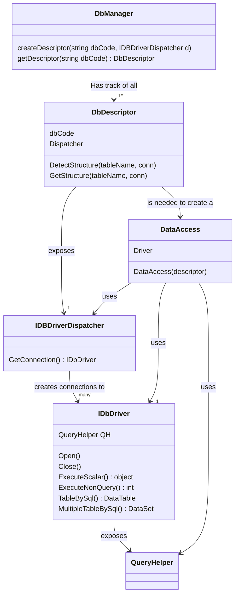

# DbDescriptor e DbManager
Lo scenario di riferimento è un'applicazione che si può collegare, a seconda della richiesta, a uno o più database, non necessariamente tutti dello stesso tipo e non necessariamente tutti aventi la stessa struttura di tabelle e campi.

Una classe di tipo DbDescriptor conosce la struttura di un database, nel senso di quali tabelle e viste contiene, quali campi ha ogni tabella e di che tipo e quali sono le chiavi primarie. L'utilità di queste informazioni è ottimizzare le operazioni di lettura potendo elencare i campi da leggere e non ricorrere alle select * from...
Inoltre consente di creare al volo DataTable che replicano la struttura delle tabelle del database.

Essendo la struttura del database una sola, ad ogni database è associata una sola istanza della classe DbDescriptor,
cosi da ottimizzare l'occupazione di memoria ed il numero di letture. Pertanto questa è condivisa tra tutte le connessioni che vengono effettuate allo stesso database.

Proprio per questo motivi, è la classe DbDStructure che espone la proprietà Dispatcher, che a sua volta ha il metodo GetConnection() da cui si ottengono le istanze di DbDriver, la classe che si occupa di inviare i comandi fisici al db nel suo dialetto SQL (SqlServer/Oracle/MySql/...) nonché le sue tabelle di sistema e dettagli tecnici.

Il numero di classi coinvolte potrebbe sembrare eccessivo tuttavia è stato necessario al fine di isolare i vari aspetti logici e fisici della gestione del database:

- DbDescriptor conosce la struttura delle tabelle di un database e come ottenere un DbDriver
- DbManager serve ad ottenere un DbDescriptor a partire dal codice alfanumerico assegnato in avvio dell'applicazione
- DbDriver conosce le particolarità tecniche di ogni tipo di database, o meglio, esiste una classe che implementa l'interfaccia IDbDriver per ogni tipo di database, e qualora non esista, non è difficile crearne una
- DataAccess serve ad effettuare operazioni primitive sul database, con comandi che ne nascondono il dialetto SQL utilizzato, ma può anche essere utilizzata per inviare comandi SQL "da codice". DataAccess è la classe con cui hanno a che fare le classi di livelli di astrazione maggiori (GetData, PostData,...)

Pertanto all'avvio dell'applicazione si associa ad ogni db gestito un codice, ed il driver ad esso associato (SqlServer/Oracle/MySql/...) e poi in ogni richiesta del client sarà richiesto al DbManager (che è un *singleton*) una connessione fisica al db (IDbDriver).

I metodi dell'applicazione però solitamente non usano istanze delle classi IDbDriver, ma la classe DataAccess, che è la classe generica di accesso al db di MDL. Tale classe nel costruttore richiede un DbDescriptor. O ancora più frequentemente, non usano neanche DataAccess bensì le classi di più alto livello GetData (per leggere interi DataSet) o PostData (per scrivere un DataSet su db in blocco)

Il metodo principale dell'interfaccia IDbDescriptor è GetStructure:

`
	Task<dbstructure> GetStructure(string tableName, IDataAccess conn);

`

usato principalmente dalla classe DataAccess per ottimizzare la lettura dei dati, oppure per creare DataTable in memoria a partire dal nome della tabella (metodo IDataAccess.CreateTable)

## Tabelle customobject e columntypes
DbDescriptor conserva le informazioni sulla struttura di un database, cosi che le operazioni su di
esso possano essere effettuate in modo più efficiente. In particolare, di default DbDescriptor utilizza due tabelle
del db stesso per descrivere le altre:

- customobject: contiene informazioni sui nomi delle tabelle e viste, e quali di queste sono tabelle fisiche 
  o viste
- columntypes: contiene informazioni sui campi di ogni tabella, come nome, tipo, lunghezza, dichiarazione sql

Se si modifica la struttura di una tabella del db, è quindi necessario aggiornare il contenuto di columntypes, richiamando in sequenza le funzioni:

`
	descriptor.Reset(tableName); //forgets informations about tableName
	descriptor.GetStructure(tableName, dataAccess); //evaluates those informations from database
`
In realtà la seconda non è necessaria qualora si decida di non utilizzare le tabelle di sistema customobject e columntypes, ponendo la proprietà *UseCustomObject* del DbDescriptor a false. In questo la prima volta che si accede ad una tabella, invece di leggere dal database il contentuo di customobject e columntypes, lo ricaverà utilizzando delle funzioni di sistema del database,che in genere impiegano più tempo.

D'altronde a regime anche senza utilizzare le tabelle suddette tutte le strutture delle tabelle si troveranno in cache ed i due sistemi diventano equivalenti, col vantaggio di non doversi preoccupare di aggiornare le due tabelle di sistema quando cambia la struttura di una tabella.

Complessivamente potrebbe risultare opportuno porre UseCustomObject = true per lavorare su un db in locale, in un'applicazione rich-client ad esempio, mentre su un backend sono abbastanza equivalenti.

## Proprietà Dispatcher
La proprietà Dispatcher della classe DbDescriptor è di tipo DBDriverDispatcher, il cui scopo è fornire le connessioni fisiche (IDbDriver) al db. Queste, come già accennato, sono a loro volta utilizzate dalla classe DataAccess. 

Il motivo per cui la classe DataAccess e la classe DbDriver sono distinte è evitare di dover derivare una classe da DataAccess tutte le volte che si vuole implementare il collegamento ad un nuovo tipo di database, oltre a isolare in una specifica classe tutte le conoscenze sul dialetto SQL e le tabelle e stored procedure di sistema di un determinato tipo di database o versione di esso (SqlServer, Oracle, etc).

Quindi supponendo di voler usare un Db di tipo diverso da quelli forniti, è sufficiente creare una classe che implementi l'interfaccia IDbDriver e corredarla di una classe IDbDriverDispatcher, con gran beneficio per i tempi di sviluppo e di test.

## DbManager "singleton"
A livello di server esiste una classe DbDescriptor per ogni database. La classe DbManager, che è un singleton, tiene 
traccia di tutti i DbDescriptor registrati.
La classe DbManager ha il solo scopo di consentire alla procedura di avvio dell'applicazione di registrare i vari db
con il metodo di DbDescriptor:

`
    void createDescriptor(string dbCode, IDbDriverDispatcher dispatcher)
`

mentre al momento dell'utilizzo sarà richiamato il metodo

`
    IDbDescriptor getDescriptor(string dbCode)
`
che restituisce il IDbDescriptor associato ad un codice.

Leggendo l'interfaccia del metodo createDescriptor si osserva che il secondo parametro è di tipo IDbDriverDispatcher. 
Tale interfaccia ha un solo metodo:

`
	public interface IDbDriverDispatcher {
			IDBDriver GetConnection();
	}
`

che serve ad ottenere un'istanza del driver fisico di database IDbDriver tutte le volte che viene invocata. E' al momento della registrazione (con createDescriptor) infatti che si stabilisce il tipo di database associato (SqlServer, Oracle, mySql,..)
Per valorizzare questo parametro si userà una delle classi DBDriverDispatcher fornite a corredo, come SqlServerDispatcher.

## Creazione e uso di un DbDescriptor
Tipicamente, per istanziare una classe DbDriveDispatcher sarà necessario specificare il nome del server, del database, login e password con cui collegarsi, che poi la classe utilizzerà per creare nuove connessioni ogni volta che le sarà richiesto.

Quando si invoca il createDescriptor, tipicamente all'avvio del servizio sul server, si passerà il codice che si è deciso di associare a quel db ed un'istanza di una classe che implementi l'interfaccia IDbDriverDispatcher, ad esempio un'istanza di  SqlServerDriverDispatcher:

`
	DbManager.instance.createDescriptor("db1", 
		new SqlServerDriverDispatcher(Server:"server name", 
									  DataBase:"Db Name",
									  UserDB:"userLogin",
									  PasswordDB:"password"
									 )
	   );
`

Questa istruzione associa al codice "db1" un database associato ad un dispatcher di driver per un db SqlServer, e il cui metodo GetConnection() restituirà a sua volta una connessione che in questo caso sarà di tipo SqlServerDriver.
La registrazione è effettuata una sola volta, ed in seguito è possibile ottenere una connessione a quel db in questo modo:

`
    var descriptor = DBManager.instance.getDescriptor("db1");
`
con la quale si ottiene un DbDescriptor al database, col quale poi possiamo ottenere la connessione al db :

`
    var conn = new DataAccess(descriptor);
`

Con questa struttura, solo al momento dell'avvio registrazione si specifica il tipo di db e le sue credenziali, e da li in poi tutto il programma può accedere al db tramite il suo codice, indipendentemente dal tipo di database, a patto di non usare sql  "diretto" ovviamente.

Pertanto in questo modo, ove non si usi sql "da codice" è possibile cambiare tipo di database senza cambiare alcuna parte dell'applicativo.

